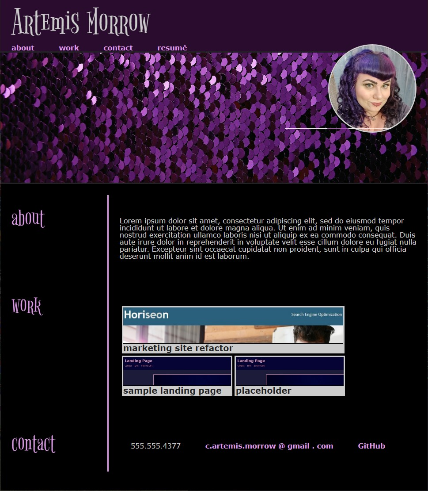

# portfolio
portfolio v. 1

**The assignment:** 
Build a personal portfolio from scratch using HTML and CSS that meets the following criteria
>GIVEN I need to sample a potential employee's previous work
>WHEN I load their portfolio
>THEN I am presented with the developer's name, a recent photo, and links to sections about them, their work, and how to contact them
>WHEN I click one of the links in the navigation
>THEN the UI scrolls to the corresponding section
>WHEN I click on the link to the section about their work
>THEN the UI scrolls to a section with titled images of the developer's applications
>WHEN I am presented with the developer's first application
>THEN that application's image should be larger in size than the others
>WHEN I click on the images of the applications
>THEN I am taken to that deployed application
>WHEN I resize the page or view the site on various screens and devices
>THEN I am presented with a responsive layout that adapts to my viewport

**Execution:** 
- built HTML skeleton (it is possible the various sections are kind of a mess), setting up a structure for...
- styled with CSS, with a particular focus on flexbox for the layout
- h1 and h2 font is [Bigelow Rules](https://fonts.google.com/specimen/Bigelow+Rules?preview.text_type=custom#standard-styles) via Google fonts
- added in media queries so everything looks pretty even on a tiny screen
- (not completely happy with the labels on the thumbnail images, but that's why this is version 1)

https://artemissorrow.github.io/portfolio/

